# 🎉 Event App

A comprehensive Flutter application for discovering, creating, and managing events with real-time updates and location-based features.


## 📱 Screenshots

### 🌞 Light Mode

#### Onboarding & Authentication
<p align="center">
  
  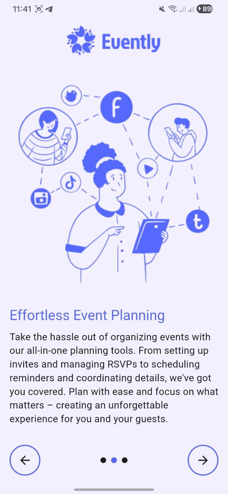
  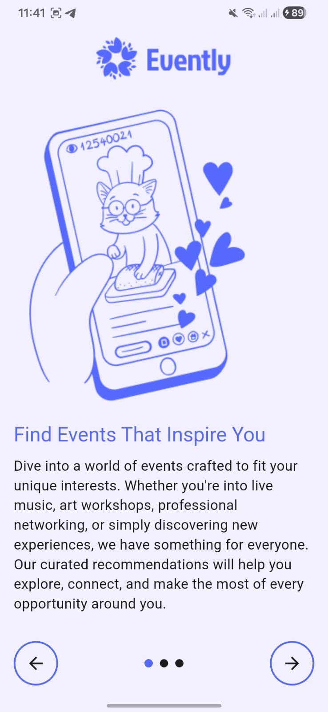
  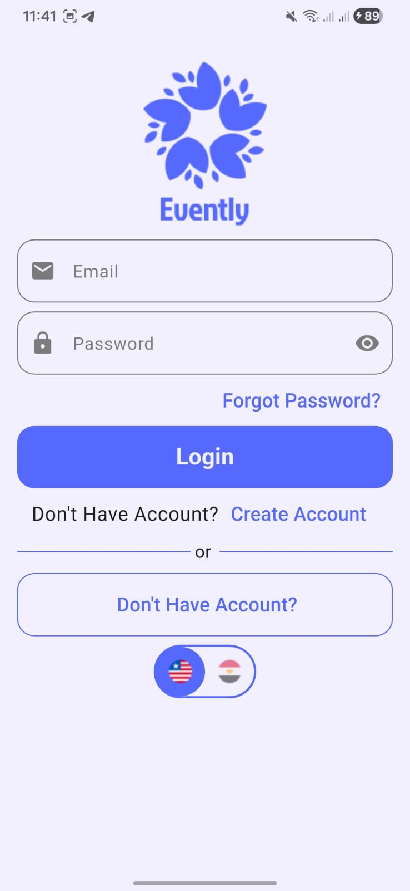
 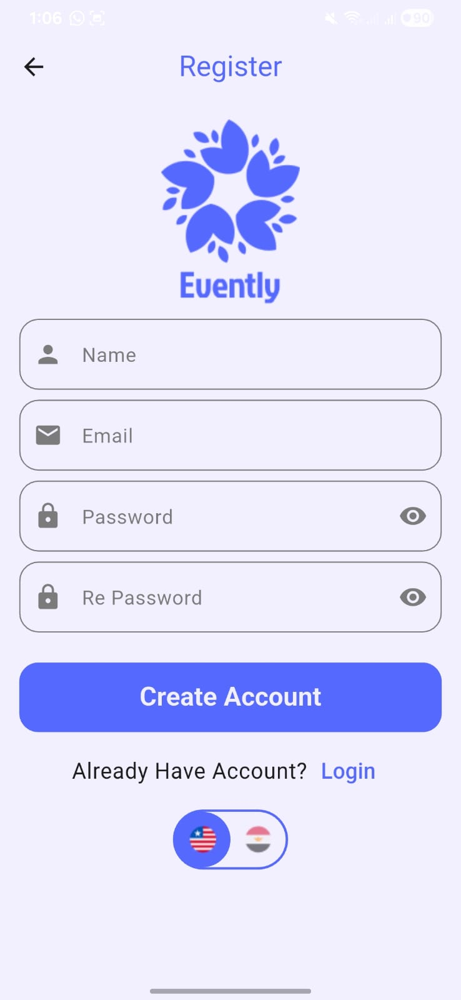
 


</p>

#### Home & Browse Events
<p align="center">
  
  
</p>

#### Create Event
<p align="center">
  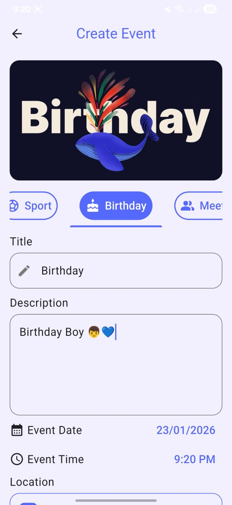
  
  


</p>

#### Map, Favorites & Profile
<p align="center">
    
    
    
</p>

---

### 🌙 Dark Mode

<p align="center">
  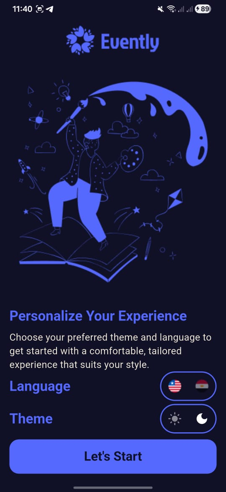
  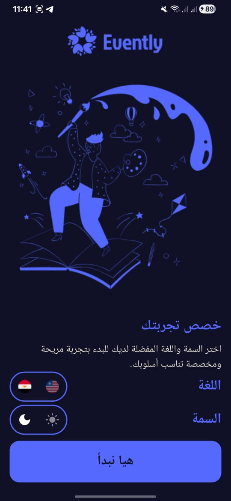
  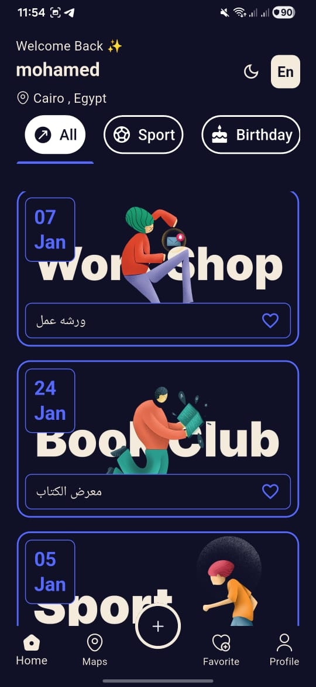
  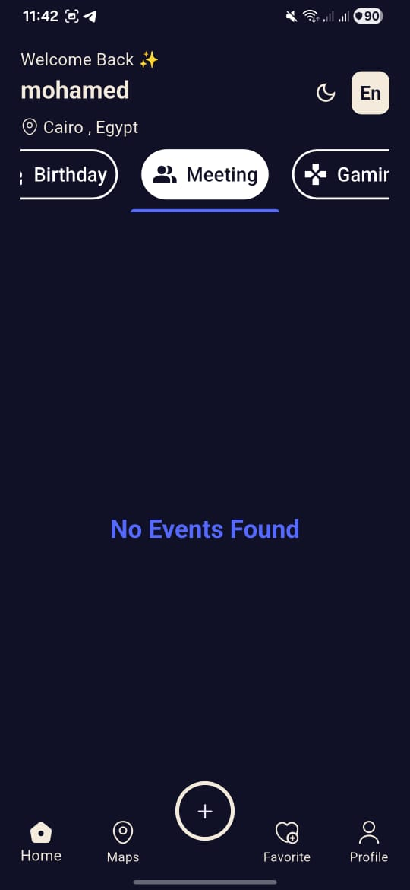
</p>

<p align="center">
 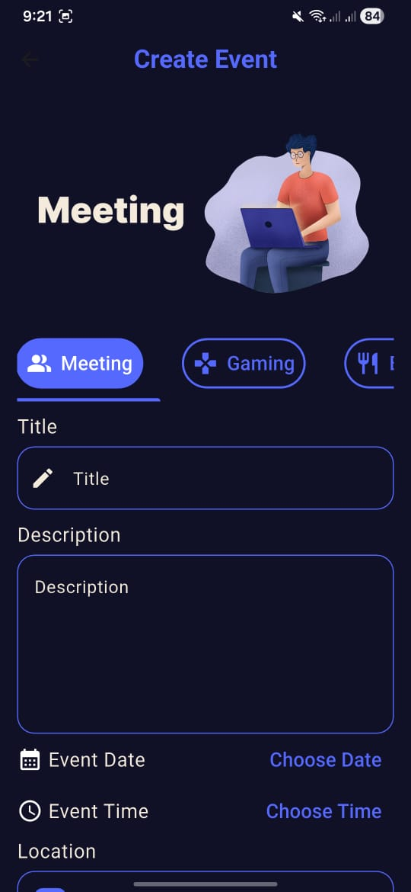
 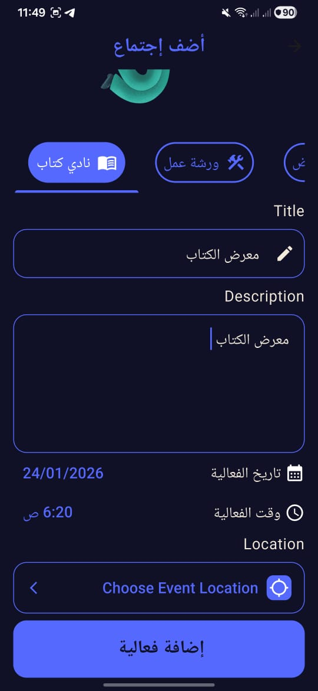
  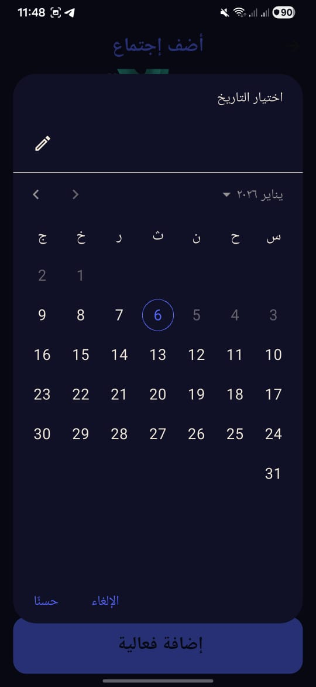

</p>

<p align="center">
  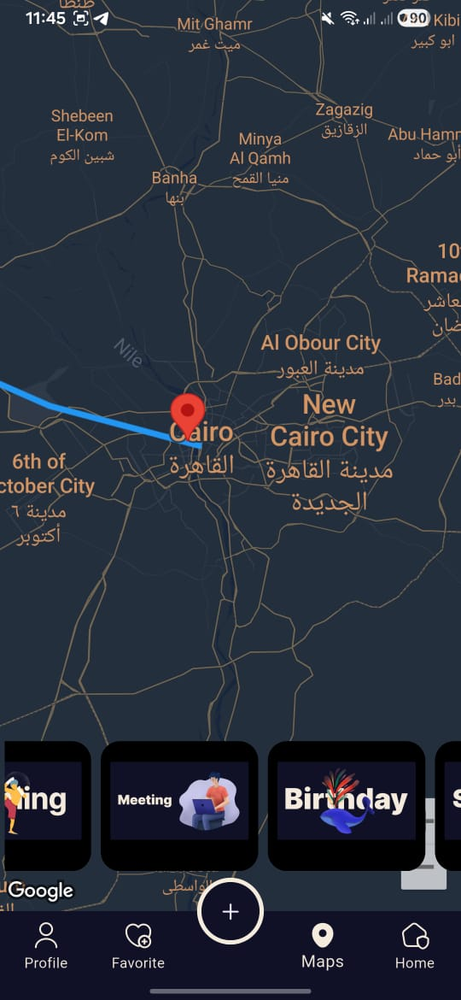
  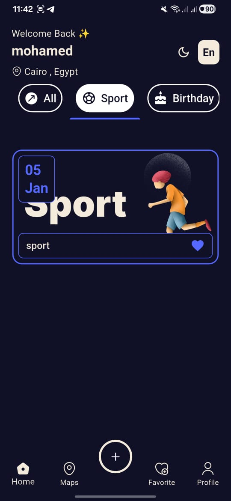
  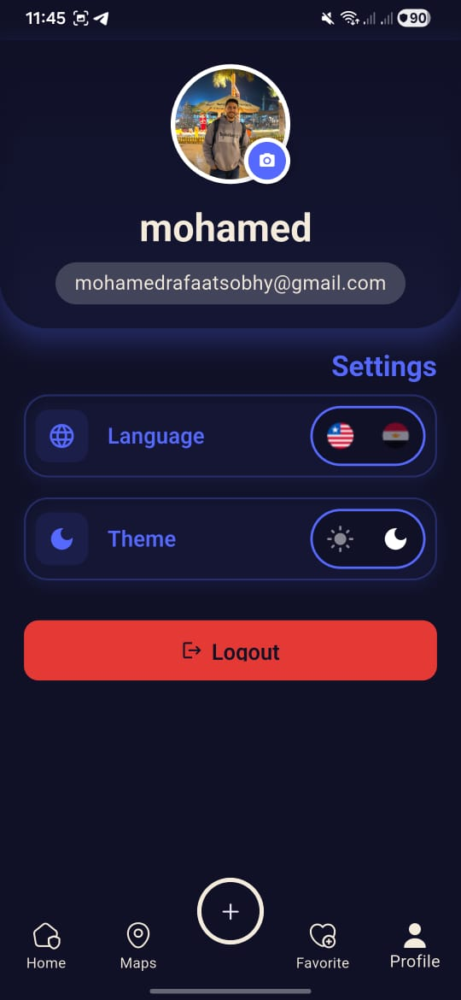
</p>


## ✨ Features

- **Authentication**: Secure login with Email/Password and Google Sign-In integration
- **Event Discovery**: Browse and search through various event categories
- **Real-time Updates**: Live event updates using Cloud Firestore
- **Location Services**: Interactive map integration with Google Maps to find nearby events
- **Multi-language Support**: Full localization support (Arabic & English)
- **Image Upload**: Upload event photos directly from camera or gallery
- **Dark/Light Mode**: Theme switching with animated toggle
- **Smooth Navigation**: Enhanced user experience with smooth page indicators

## 🛠️ Tech Stack

- **Framework**: Flutter 3.9.0+
- **State Management**: Provider
- **Backend**: Firebase (Authentication, Cloud Firestore)
- **Maps**: Google Maps Flutter
- **Authentication**: Google Sign-In
- **UI/UX**: Material Design with Cupertino Icons

## 📦 Dependencies

```yaml
dependencies:
  provider: ^6.1.5+1
  firebase_core: ^4.1.1
  firebase_auth: ^6.1.0
  cloud_firestore: ^6.0.2
  google_maps_flutter: ^2.13.1
  google_sign_in: ^7.2.0
  image_picker: ^1.2.0
  animated_toggle_switch: ^0.8.5
  smooth_page_indicator: ^1.2.1
  intl: ^0.20.2
  icons_plus: ^5.0.0
```

## 🚀 Getting Started

### Prerequisites

- Flutter SDK (3.9.0 or higher)
- Dart SDK
- Android Studio / VS Code
- Firebase account
- Google Maps API key

### Installation

1. **Clone the repository**
   ```bash
   git clone https://github.com/yourusername/event_app.git
   cd event_app
   ```

2. **Install dependencies**
   ```bash
   flutter pub get
   ```

3. **Firebase Setup**
   - Create a new Firebase project at [Firebase Console](https://console.firebase.google.com/)
   - Add your Android/iOS app to the Firebase project
   - Download `google-services.json` (Android) and `GoogleService-Info.plist` (iOS)
   - Place them in the appropriate directories:
     - Android: `android/app/google-services.json`
     - iOS: `ios/Runner/GoogleService-Info.plist`

4. **Google Maps Setup**
   - Get a Google Maps API key from [Google Cloud Console](https://console.cloud.google.com/)
   - Add the API key to:
     - Android: `android/app/src/main/AndroidManifest.xml`
     ```xml
     <meta-data
         android:name="com.google.android.geo.API_KEY"
         android:value="YOUR_API_KEY_HERE"/>
     ```
     - iOS: `ios/Runner/AppDelegate.swift`
     ```swift
     GMSServices.provideAPIKey("YOUR_API_KEY_HERE")
     ```

5. **Run the app**
   ```bash
   flutter run
   ```

## 📁 Project Structure

```
lib/
├── main.dart
├── models/           # Data models
├── providers/        # State management
├── screens/          # UI screens
├── widgets/          # Reusable widgets
├── services/         # Firebase & API services
├── utils/            # Helpers & constants
└── l10n/             # Localization files

assets/
├── images/           # App images
└── caregories_images/  # Category icons
```

## 🌍 Localization

The app supports multiple languages with Flutter's localization system. Currently supported languages:
- English (en)
- Arabic (ar)

To add more languages, update the `l10n` folder and regenerate localization files:
```bash
flutter gen-l10n
```

## 🔥 Firebase Configuration

Ensure you have enabled the following Firebase services:
- ✅ Authentication (Email/Password & Google Sign-In)
- ✅ Cloud Firestore
- ✅ Storage (if using image uploads to Firebase)

### Firestore Security Rules Example

```javascript
rules_version = '2';
service cloud.firestore {
  match /databases/{database}/documents {
    match /events/{eventId} {
      allow read: if request.auth != null;
      allow write: if request.auth != null;
    }
  }
}
```

## 🧪 Testing

Run tests using:
```bash
flutter test
```

## 📱 Build

### Android
```bash
flutter build apk --release
```

### iOS
```bash
flutter build ios --release
```

## 🤝 Contributing

Contributions are welcome! Please follow these steps:

1. Fork the project
2. Create your feature branch (`git checkout -b feature/AmazingFeature`)
3. Commit your changes (`git commit -m 'Add some AmazingFeature'`)
4. Push to the branch (`git push origin feature/AmazingFeature`)
5. Open a Pull Request

## 📄 License

This project is licensed under the MIT License - see the [LICENSE](LICENSE) file for details.

## 👨‍💻 Author

**Your Name**
- GitHub: [@yourusername](https://github.com/yourusername)
- Email: your.email@example.com

## 🙏 Acknowledgments

- Flutter team for the amazing framework
- Firebase for backend services
- All contributors who helped with this project

---

Made with ❤️ using Flutter
